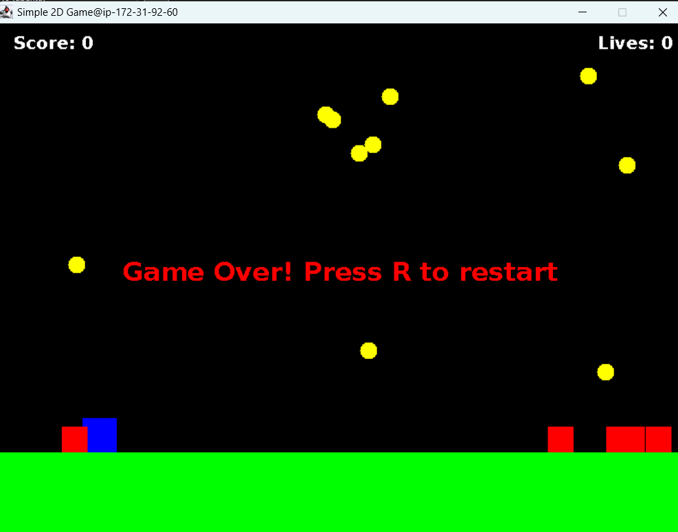
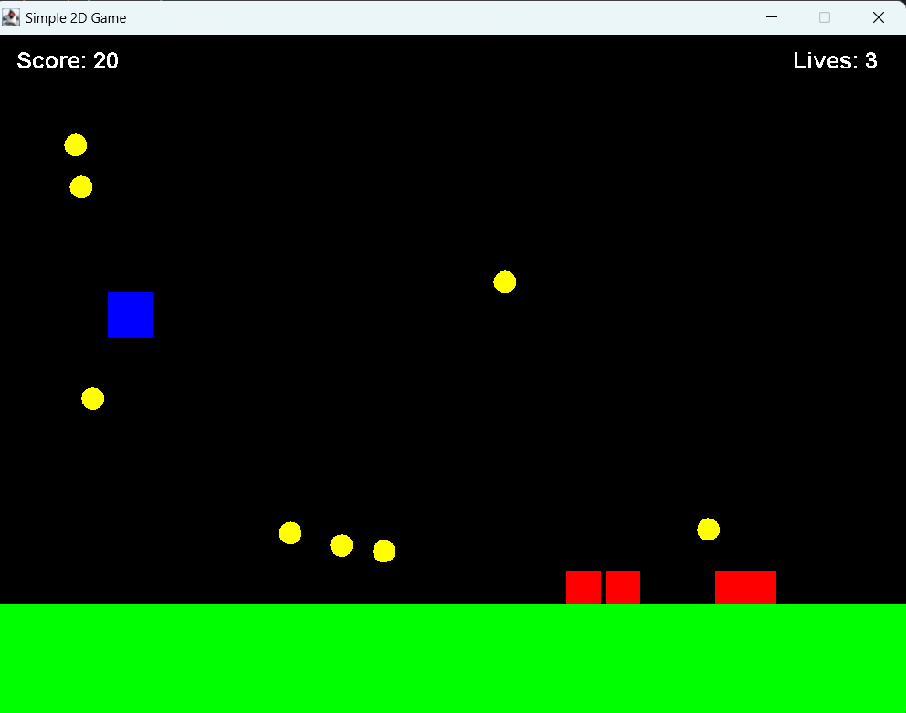

# Java 2-D game using Amazon Q Developer CLI
I created a simple 2-D game using Java just by giving a prompt to Q CLI and it created a fully functional 2-D Game!

  

Read more about Amazon Q Developer CLI : https://aws.amazon.com/blogs/devops/introducing-the-enhanced-command-line-interface-in-amazon-q-developer/

 

### Steps to run the game:
1) Clone the repository locally.
2) Compile all the classes using `javac <class-name.java>`
3) Run the game using below command:
   `java SimpleGame`

### Screenshots:
 

   

### Game demo:

[Video of the game](https://www.youtube.com/watch?v=PSugU6JjELo)

 

#### Blog which I wrote about this : https://ruchirstechblogs.hashnode.dev/from-a-prompt-to-a-playable-game-my-amazon-q-cli-experiment
